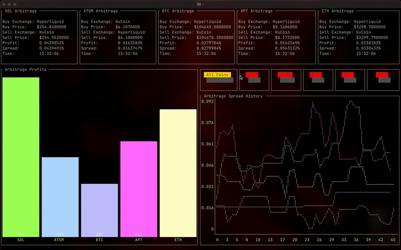

# ArbiBot: Cross-Exchange Arbitrage Bot

ArbiBot is a high-performance, cross-exchange arbitrage bot designed to identify and capitalize on price discrepancies across multiple cryptocurrency exchanges. Built in Go, ArbiBot leverages WebSocket connections to provide real-time market data analysis, enabling users to execute arbitrage strategies with minimal latency. **Note: This project is still under active development**

## Demo
Below is a visual representation of ArbiBot in action, showcasing its real-time detection of arbitrage opportunities across various trading pairs:




## Features

- **Real-Time Market Data**: Connects to multiple exchanges via WebSocket for real-time order book updates.
- **Cross-Exchange Arbitrage**: Identifies arbitrage opportunities by comparing prices across different exchanges.
- **High Performance**: Optimized for low-latency operations, ensuring quick detection of arbitrage opportunities.
- **Modular Design**: Easily extendable to support additional exchanges and trading pairs.
- **Graceful Shutdown**: Handles interruptions gracefully, ensuring all connections are closed properly.

## Supported Exchanges

- **Hyperliquid**
- **KuCoin**

## Getting Started

### Prerequisites

- Go 1.23.2 or higher
- GitHub account for dependency management

### Installation

1. Clone the repository:

   ```bash
   git clone https://github.com/yourusername/ArbiBot.git
   cd ArbiBot
    ```
2. Install dependencies:

   ```bash
   go mod download
    ```
3. Build and Run the bot:

   ```bash
   make run
    ```
   The bot will start monitoring the specified trading pairs and log any arbitrage opportunities it detects.

### Contributing
We welcome contributions! Please read our Contributing Guidelines for more information on how to get started.
